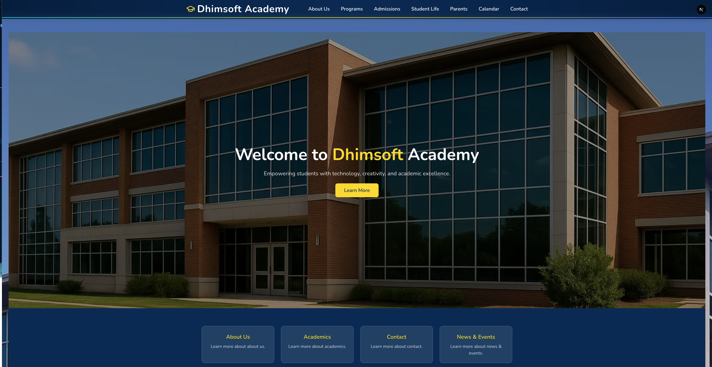
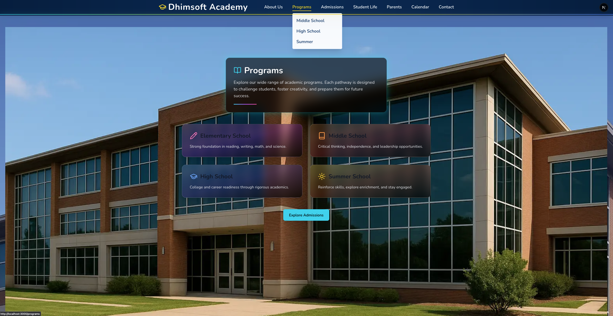
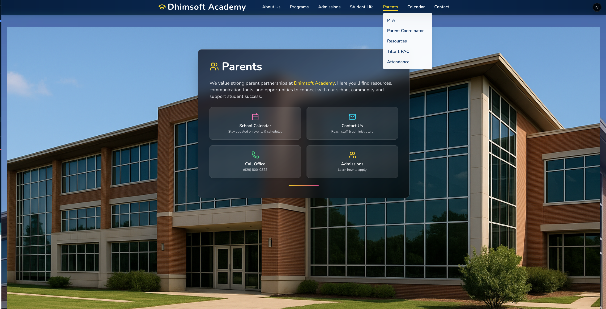
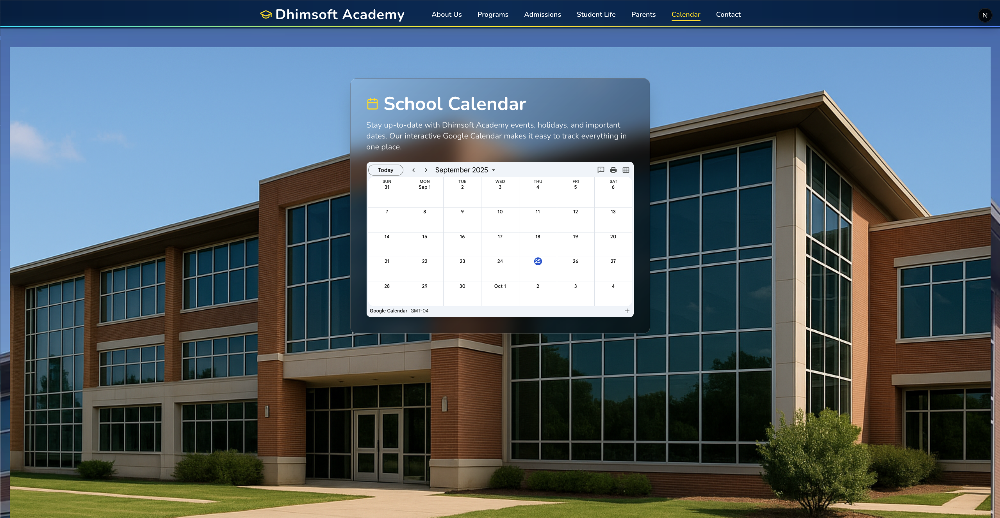
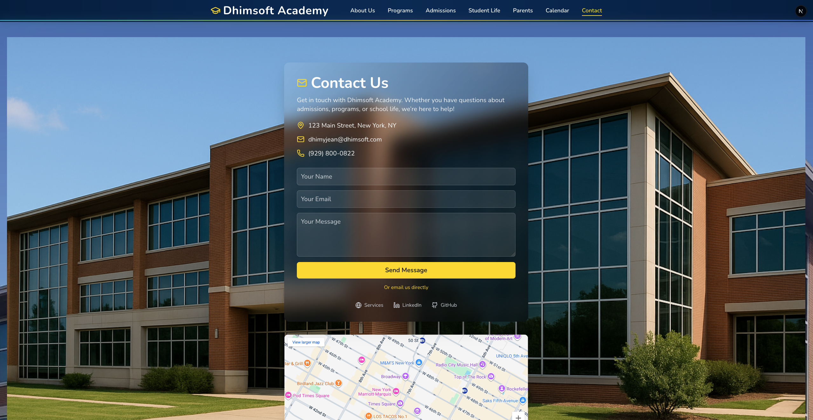

# 🎓 Dhimsoft Academy Website  

[](https://dhimsoft-academy.vercel.app)  
[](https://dhimsoft-academy.vercel.app)  
  
  


---

## 🚀 Overview  
**Dhimsoft Academy** is a fully responsive **school website prototype** built with **Next.js** and **Tailwind CSS**.  

It demonstrates how modern educational institutions can showcase **programs, admissions, resources, parent communication tools, and events** in a professional, accessible, and engaging way.  

This project is part of the **Dhimsoft portfolio** to:  
- ✅ Showcase technical skills in full-stack development, UI/UX design, and deployment.  
- ✅ Serve as a **demo product** that can be customized and sold to schools, academies, and training centers.  

---

## 🛠️ Tech Stack  

- **Framework:** Next.js 15 (App Router)  
- **Styling:** Tailwind CSS 4.0 (utility-first, responsive design)  
- **Icons:** Lucide React (clean, scalable icons)  
- **Deployment:** Vercel (CI/CD, global edge network)  
- **Forms:** API routes with form handling (Contact & Inquiry)  
- **Google Maps Integration:** Visit Us page  
- **Version Control:** Git & GitHub  

---

## 🎨 Key Features  

### 🌐 Website Pages  
- **Home** — Hero section, quick links, news & events.  
- **About Us** — Mission, vision, and history.  
- **Programs** — Educational offerings with highlights.  
- **Admissions** — Step-by-step enrollment guidance.  
- **Parents** — Subsections: PTA, Parent Coordinator, Resources, Title I PAC, Attendance.  
- **Resources** — Policies, forms & documents, guides/support.  
- **Students** — Student life, clubs, and activities.  
- **Calendar** — Upcoming events (interactive).  
- **Contact** — Inquiry & contact form with validation + direct email.  
- **Visit Us** — Google Maps embed + scheduling a visit.  
- **404 Page** — Custom error page with branding.  

### 🛡️ Design & Engineering  
- **Responsive Layout** — Works seamlessly across devices.  
- **Glassmorphism & Gradients** — Modern UI trend with depth.  
- **Reusable Components** — Header, footer, hero sections, cards, grids.  
- **Form Handling** — Inquiry & Contact forms with JSON API routes.  
- **Optimized Performance** — Static assets stored in `/public/images`.  

---

## 📸 Screenshots  

### Home Page  
  

### About Page  
  

### Programs Page  
  

### Admissions Page  
  

### Parents Section  
  

### Resources Page  
  

### Students Page  
  

### Calendar Page  
  

### Contact Page  
  

---

## 🔍 Learning & Challenges  

This project involved:  
- Structuring a **multi-page Next.js app** with nested routes.  
- Managing **form data submission** with API routes & JSON validation.  
- Debugging **Google Maps integration** (`pb` parameter issue).  
- Handling **404 fallbacks** for not-yet-implemented pages.  
- Creating a **realistic prototype** without exposing sensitive data.  

---

## 💡 Future Enhancements  

- 📊 **Database integration** (PostgreSQL / Supabase) for dynamic content.  
- 🛠️ **Admin dashboard** for schools to manage announcements/events.  
- 🔑 **Authentication system** for parents, teachers, students.  
- 🤖 **AI-powered chatbot** for answering parent inquiries.  
- 📝 **CMS integration** (Sanity, Strapi) for easier content management.  

---

## 📂 Project Purpose  

This is **not a real school**, but a **professional prototype**:  
- 🎯 **For recruiters** → to evaluate technical depth, design ability, and deployment skills.  
- 🎯 **For clients** → to preview a ready-to-customize school website product.  

---

## 📞 Contact  

👨‍💻 **Dhimy Jean**  
📧 Email: [dhimyjean@dhimsoft.com](mailto:dhimyjean@dhimsoft.com)  
🌐 Portfolio: [https://dhimsoft.com](https://dhimsoft.com)  
💼 LinkedIn: [https://linkedin.com/in/dhimy-jean](https://linkedin.com/in/dhimy-jean)  
🐙 GitHub: [https://github.com/dhimsoft](https://github.com/dhimsoft)  

---

## ⚙️ Getting Started (Local)  

```bash
# Clone the repository
git clone https://github.com/your-username/dhimsoft-academy.git

# Navigate into the folder
cd dhimsoft-academy

# Install dependencies
npm install

# Run development server
npm run dev


© 2025 Dhimsoft Academy (Prototype). Licensed under the MIT License.