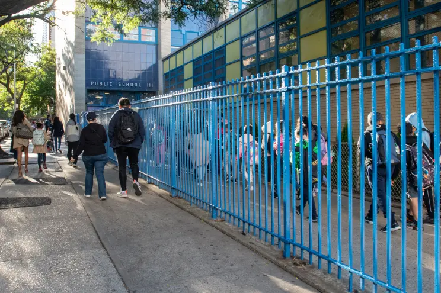

# P.S. 111 School Website

[](https://ps111-website.vercel.app)


This is the official website for **P.S. 111 Adolph S. Ochs**, built using [Next.js](https://nextjs.org/) and [Tailwind CSS](https://tailwindcss.com/).  
The site highlights school information, academics, events, and provides contact forms for families and the community.

---

## Features
- **Modern Design**: Clean and accessible layout optimized for all devices.
- **Dynamic Content**: News & Events preview, academic highlights, and contact form.
- **Interactive Contact Form**: Styled form with playful icons and animations.
- **Optimized for Speed**: Built with Next.js for fast rendering and great SEO.

---

## Tech Stack
- **Framework**: Next.js 15
- **Styling**: Tailwind CSS
- **Icons**: Lucide React
- **Deployment**: Vercel

---
## Screenshots
### Home Page


### Contact Page


---
## Getting Started (Local)
```bash
# Install dependencies
npm install

# Run the development server
npm run dev


